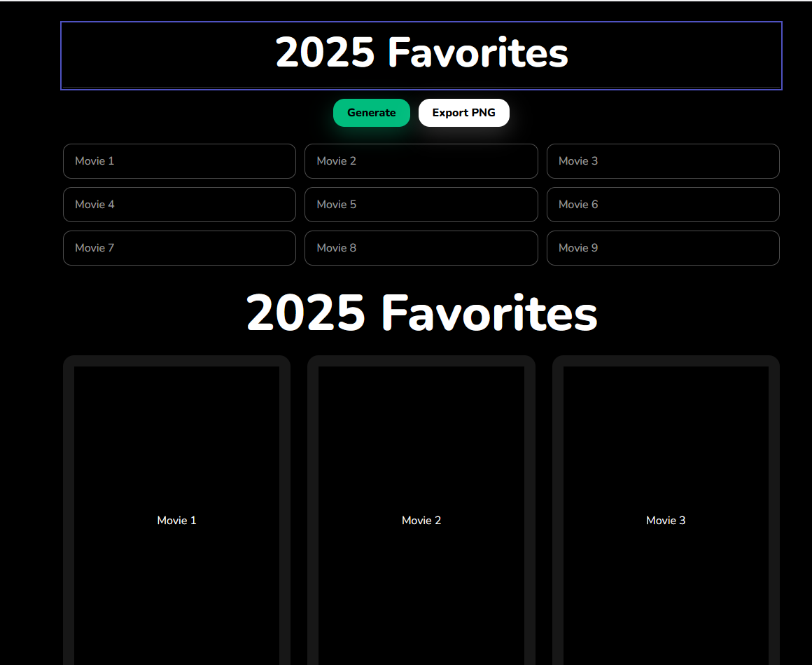

# 🎬 movie-rating-app

A Next.js + TypeScript app to search TMDb, pick **9 posters (3×3)** with ratings, and export the collage as a PNG.

- [Features](#-features)
- [Demo](#-demo)
- [Tech Stack](#-tech-stack)
- [Getting Started](#-getting-started)
- [Usage](#usage)
- [Configuration](#-configuration)
- [How it works](#-how-it-works)
- [Screenshots](#-screenshots)
- [License](#-license)
- [Notes](#notes)

---

## ✨ Features

- Fast search autocomplete (keyboard: ↑/↓, Enter)
- Clean poster rendering with pleasant aspect ratio
- TMDb `vote_average` (0–10) → **0–5 green stars**
- 3×3 grid with editable big title
- **Export to PNG** via `html-to-image`
- Responsive layout
- Only requires a TMDb v4 bearer token

---

## 🎮 Demo

- **Live**: https://szs-movie-rating-app-lilac.vercel.app/

---

## 🧰 Tech Stack

- Next.js 15
- TypeScript
- Tailwind CSS
- TMDb image CDN (w342 by default)
- html-to-image for export

---

## 🚀 Getting Started

### Prerequisites
- Node.js 20+
- TMDb v4 Bearer Token

### 1) Clone & install
git clone https://github.com/Willszs/movie-rating-app.git  
cd movie-rating-app  
npm i # or yarn / pnpm  

### 2) Environment
Create a `.env.local` in the project root:  
TMDB_V4_TOKEN=your_long_bearer_token

### 3) Run
npm run dev # http://localhost:3000

### 4) Build
npm run build && npm start

---

## Usage

1. Use the 9 inputs to **search and select** movies (navigate with ↑/↓, press Enter to select).
2. The selected movie fills the slot with the **poster** and **star rating**.
3. After all 9 are set, click **Export** to download a **PNG** of the collage.

---

## ⚙️ Configuration

| Key               | Example                       | Notes                                  |
|-------------------|-------------------------------|----------------------------------------|
| TMDB_V4_TOKEN     | eyJhbGciOiJIUzI1NiJ9...       | Used by `/api/search` (server route)   |

Poster size/quality can be tuned in `app/api/search/route.ts` and the grid card component.

---

## 🧩 How it works

**Flow**
1. User types in a search box (one of the 9).
2. Client calls `/api/search?q=...` (Next.js Route Handler).
3. Server requests TMDb (v4 bearer) and normalizes fields.
4. Dropdown shows results; selecting one fills the tile (poster + stars).
5. Export uses `html-to-image` to capture the grid DOM and save as PNG.

---

## 🖼️ Screenshots

Upload **UI screenshots** into `docs/` (do not store full poster assets).

- Autocomplete — docs/autocomplete.png  
- Finished collage — docs/finished.png  

---

## 📜 License

MIT © Willszs

---

## Notes

This product uses the TMDb API but is not endorsed or certified by TMDb.
